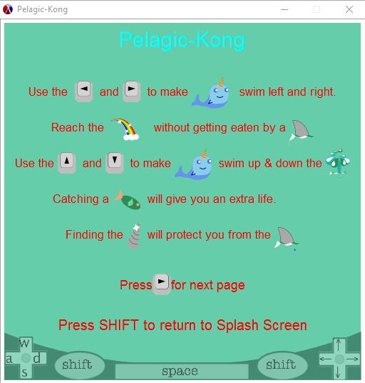
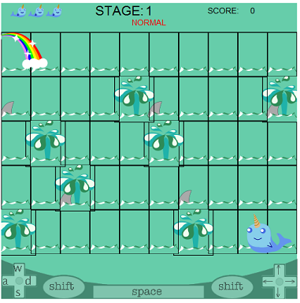
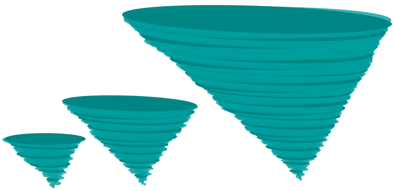

# Pelagic-Kong
### Kelly Stilson
### Overview
Our project is a game in the style/inspired by Donkey Kong. 
The first screen that displays is a splash screen, where it allows the player to select the difficulty for the game, view the help screens, or start the game. The help screens display instructions for game-play, movement keys, the goal and different aspects of game play.

 

Once starting the game, the goal is to get the character sprite up the water spouts to the rainbow, without encountering any sharks. If the character gets too close to a shark, it dies, loses a life, and starts back at the start postition of the stage. 
If the character reaches the rainbow, the player advances to the next stage. If the player loses all their lives it is game-over, and they are returned to the splash-screen. If the player continues to win, the stages get more difficult. The number of sharks increases, their direction varies, and their speed increases. The player is however, offered super-powers, which assist them in the more difficult levels. An armored horn makes the character impervious to shark attacks, and catching a fish give the player an extra life. 
If a player is just too-good, they advance from the normal difficulty to sharks-with-laser-beams, which can kill the character from farther away. The next difficulty level is Sharknado, where a tornado of sharks drops random sharks on the stage.

### Libraries used:
```racket
(require 2htdp/image)
(require 2htdp/universe)
(require lang/posn)
```

- 2htdp/universe: provided the `big-bang` function that was used as the driver for the game.  
  Included in this are:
  
  `(on-tick <proc> s)` : takes a procedure as an arg, and applies that procedure to the state of the world. Ticks 28 times a second. used for time keeping which facilitated movement.
  
  `(on-draw <proc> s)` : takes a procedure as an arg and applies it to the state of the world, procedure must return an image object. Called every time the universe handles an event. used to render the stage after every tick, and every key-press.
 
  `(on-key <proc> s ke)` : takes a procedure as an arg and applies it to the state of the world, passing along the key-event that triggered it. This is how keyboard input was handled.

  `(on-pad <proc> s pe)` : similar to on-key, but limited to only pad-keys. we limited keyboard input during game-play to just the pad keys. this also automatically included an image placed on the bottom of the screen reminding players of the movement keys.
 
- 2htdp/images: all of the image functions: drawing lines, angles, curves, and shapes; rotate, scale, and flip image functions. `place-image`, which places one image on another; `place-images`, which maps through two lists, one of images and one of posns, to place the images at those posns, `overlay`/`underlay` which allowed me to place images in layers. Also all the text, font and color formatting functions.

- lang/posn : provided the `make-posn` constructor, as well as equality tests, and accessors for the x and y portions of the posn


### Using Recursion and Map to build the game board:

A couple recursive functions were used to create the board, or the background of each stage. The background is a list of tile objects implemented in such a way as to form a matrix, with each tile having an x and y position on the board. To create a tile object, the program needs to know if it is a spout tile (#t/#f) and its position on the background. It stored the position of the tile so that it can be referenced during gameplay to verify that the player is on, or near, a water spout tile in order to move up to the next 'floor.'

The stage starts out as a list of integers which represent the numbered position in the board matrix that the spouts should be placed.
```racket    
(define (spout-list d) 
  (let ([l (stage_number d)])  
(cond ((eq? l 1) (list 14 19 21 25 32 40 46))  
     ((eq? l 2) (list 17 21 28 35 41 46))    
     ((eq? l 3) (list 19 25 30 39 45)) 
     ((eq? l 4) (list 15 24 26 33 37 42 48)) 
     ((eq? l 5) (list 13 17 25 33 37 44 45 46))  
     ((eq? l 6) (list 12 18 23 36 45)) 
     ((eq? l 7) (list 16 21 29 35 47)) 
     ((eq? l 8) (list 13 25 37 49))  
     ((eq? l 9) (list 14 18 21 29 33 46))  
     (else (list 14 18 24 29)))))  
                                         
(define-struct/contract tile ([up? boolean?] 
                             [position any/c]) 
 #:transparent)                                
```                                            
The tile-posn-list is a list of posn objects created using two recursive functions. The first being build-posn-list, which takes an x value, y value and a list. This function creates the 'rows' of the board. If the y-value argument is too small to fit another tile, then the list is returned, if not, then it calls itself again, altering the y-value and calling the make-wide function. 
```racket
(define (tile-posn-list d)
  (build-posn-list (posn-x WINDOW) (- (posn-y WINDOW) TILE_HEIGHT) '()))

(define (build-posn-list x y l)
  (if (< y TILE_HEIGHT) l
      (build-posn-list x (- y TILE_HEIGHT) (make-wide x (- y TILE_HEIGHT) l))))
      
(define (make-wide x y l)
  (if (eq? 0 x) l
      (make-wide (- x TILE_WIDTH) y 
                    (append (list (make-posn (- x (quotient TILE_WIDTH 2)) (+ y (quotient TILE_HEIGHT 2)))) l))))
```
The make-wide function creates the posns for the columns of the board. If the x-value argument reaches 0 then it will return the list, if not, it will call the function again, decreasing the x-value by the width of a tile, and appending a new posn to the list.

The build-board function only takes the difficulty level of the stage as an argument. It uses let\* to determine the number of rows and columns required in the board matrix based on the size of the window and the size of the tiles. 

*Note: this functionality was built-in incase we got to the point of creating more difficult levels where there were more "floors," or rows of tiles, and would therefore have to scale the size of the tile.*

It then maps through the list of #t/#f values for determining the type of tile, and the list of positions, created recursively, and calls the tile constructor, to return a list of tiles. 
```racket
(define (build-board diff-level)
  (let* ([x (/ (posn-x WINDOW) TILE_WIDTH)]
         [y (quotient (- (posn-y WINDOW) TILE_HEIGHT) TILE_HEIGHT)])
    (map (lambda (s p) (make-tile s p))
         (for/list ([i (in-range 0 (* x y))])
           (if (member i (spout-list diff-level)) #t #f))
         (tile-posn-list diff-level))))
```
This board, a list of tile objects, is a part of the stage and later drawn, producing the background(shown below with frames on tiles):

 


### Drawing Images using Recursion
The tornado base of the Sharknado is actually an ellipse drawn recursively based on the number passed to the function.
*Note: Again, this was done so that we could scale the image based on the window size, but without having to stretch the image, which would distort it*

The `draw-sharknado` function takes an image and an integer size as args. It uses let\* to assign local variables used to draw each ellipse. The changes in these variables give the tornado dimension. Using a random number from a small range is what gave the illusion of the tornado twisting when it was redrawn every 1/28th of a second. 
The body of the function determines if the size is zero, return the image, otherwise, it overlays another ellipse ontop of the image, using the determined arguments, and then passes the `draw-sharknado` function as the image arg of the overlay function.
The sharkfins are placed on the tornado afterwards. 
```racket
 (define (draw-sharknado image s)
   (let* ([angle (if (zero? (remainder s 3)) 0 -2)]
          [color (if (zero? (remainder s 5)) dark-wind light-wind)]
          [x-offset (if (zero? (remainder s 3)) (- 0 (random 1 10)) (random 1 10))]
          [y-offset (random 4 6)]
          [width (* s 7)]
          [height (* 10 (ceiling (/ width 100)))])
   (cond ((zero? s) image)
         ((overlay/align/offset "center" "top"
                                (rotate angle (ellipse width height "solid" color))
                                x-offset y-offset
                                (draw-sharknado image (sub1 s)))))))
```


These images aren't scaled, but varying recursion depths of 30, 50 and 100.


### Filtering out unwanted elements
In the `BEHOLD-stage` funtion that renders all the images for each stage, the list of components is assigned, and then the list of posns where those images need to be drawn in a let\* statement. Because the super-powers given to the player should only appear once the player reaches stage 5, I needed some way of including the super-power images and posns only when necessary.
The images of the super-horn and the fish should only be included in the list of images if the stage is `>= 5` and the player hasn't already claimed the super-power for that stage. Once the player has claimed the super-power, the posn of that image is modified to #f. 
Before placing the images, I used `filter` to remove any empty lists from the `stage-comp` list, and any #f values from the `stage-posn` list.

```racket
; **returns IMAGE object** NOT world state
(define (BEHOLD-Stage s)
  (cond ((eq? 'start (world-state s))  ;;creates original stage
         (let* ([stage_n (stage_number (world-difficulty s))]
                [difficulty_level (world-difficulty s)]
                [time (world-time s)]
                [player (world-player s)]
                [score (world-score s)]
                [sp (make-super-powers (super-powers-state (stage-super-powers (world-stage s)))
                                       (if (< stage_n 5) #f (super-powers-armor-pos (stage-super-powers (world-stage s))))
                                       (if (and (>= stage_n 5) (< (player-lives player) 5)) 
                                                (super-powers-fish-pos (stage-super-powers (world-stage s))) #f))]
                [st (make-stage 'playing difficulty_level (draw-enemies difficulty_level stage_n time)
                                (swim (player-state player) (player-direction player) time)
                                (draw-HUD (player-lives player) difficulty_level score)
                                (build-board difficulty_level) sp)]
                [stage-comp (append (list (scale (if(eq? (player-state player) 'super) 5/9 1/2)
                                                 (swim (player-state player) (player-direction player) time))
                                    (rainbow time)
                                    (stage-HUD st))
                                    (if(super-powers-state sp) (list (if(super-powers-armor-pos sp) (scale 2/3 (super-horn time)) '())
                                                                     (if(super-powers-fish-pos sp) (scale 2/3 fish) '())) '())
                                    (place-tiles (stage-board st))
                                    (for/list ([i (length (stage-Enemies st))])
                                              (cond ((< difficulty_level 10) (if(< i 6) (flip-horizontal sharkfin) sharkfin))
                                                    ((< difficulty_level 100) (if(< i 6) (flip-horizontal laser-shark) laser-shark))
                                                    ((< difficulty_level 1000) (if(< i 6) (flip-horizontal laser-shark)sharkfin)))))]
                [stage-posn (append (list (player-position player) (make-posn 50 75) (make-posn (quotient (posn-x WINDOW) 2) 18))
                                    (if(super-powers-state sp) (list (super-powers-armor-pos sp) (super-powers-fish-pos sp)) '())
                                    (tile-posn-list stage_n)
                                    (for/list ([i (stage-Enemies st)])
                                        (shark-p i)))])
          ;;draw stage components and test for sharknado animation
        (cond ((>= difficulty_level 100) (create-sharknado time (place-images (filter (lambda (e) (not (empty? e))) stage-comp)
                                                                              (filter (lambda (e) (not (eq? #f e))) stage-posn)
                                                                              BACKGROUND)))
              (else (place-images (filter (lambda (e) (not (empty? e))) stage-comp)
                                  (filter (lambda (e) (not (eq? #f e))) stage-posn)
                                  BACKGROUND)))))
 ```
The enemies, or list of sharks, was created using a map function based on the difficulty level and stage number.

### Use foldl in collision detection
The `2htdp/images` did not provide an intersect function to test if one image overlaped another. So I wrote a collision detection function.
The `object_collision?` function that tested if Walley's position was close enough to an object, took Walley, and the object as args. It determined if one of the sides if the object's 'bounding box' were between the sides of Walley's 'bounding box.' If the sides overlapped then it returned true, if not, then returned false.
The difficulty came when I needed to know if Walley collides with a shark, and because at each stage there are differing numbers or sharks, I needed a function to check all of the sharks, and return just one value. I didn't need to know which shark, just that he hit one of them, or none of them. So, I could either use recursion that would stop once the return of a collision test was #t, or check them all, and accumulate the results.
I decided to use `foldl` to pass each shark in the `list-of-sharks` for that stage, to the collision function and return a #t/#f, which was accumulated with an `or` with the result of the previous test, and then returned.
```; return true/false
(define (object_collision? player object)
  (let* ([walley_left (posn-x player)]
         [walley_right (+ walley_left 110)]
         [walley_top (posn-y player)]
         [walley_bottom (+ walley_top 75)]
         [wider (if(shark? object) (if(>= (shark-difficulty object) 10) 1.7 1) 1)] 
         [object_left (if(shark? object) (posn-x (shark-p object)) (posn-x object))]
         [object_right (if(shark? object) (+ object_left (* wider 50)) (+ object_left 15))]
         [object_top (if(shark? object) (posn-y (shark-p object)) (posn-y object))]
         [object_bottom (if(shark? object) (+ object_top 30) (+ object_top 15))])
    (and (or (>= walley_right object_right walley_left)
         (<= walley_right object_left walley_left))
         (or (>= walley_top object_top walley_bottom)
         (<= walley_top object_bottom walley_bottom)))))

(define (shark_collision? player-pos list-of-sharks)
  (foldl (lambda (shark result) (or (object_collision? player-pos shark) result))
         #f
         list-of-sharks))
```
*I did learn at this point, that many of the comparision procedures could take several arguments, which meant I could compare several values all at once, without having `(and (>= x y) (>= y z))`. Instead `>= arg_1 arg_2 ag_3` checks if all the args are in descending order*

### State Modificiation and Data Abstraction
Since we used the `big-bang` function to create and drive our game, we needed to define the world. I defined the world using a struct because it automatically came with a constructor, type-checking and accessors for each field.
```racket
(define-struct/contract world ([state (or/c 'splash_screen
                                            'start
                                            'playing
                                            'paused
                                            'won
                                            'lost
                                            'help_screen
                                            'help_screen_2)]
                               [time (and/c natural-number/c (<=/c 100000))]
                               [player (or/c #f player?)]
                               [difficulty (and/c natural-number/c (<=/c 1000))]
                               [score (and/c natural-number/c (>=/c 0))]
                               [stage (or/c #f stage?)])
  #:transparent)
```
I defined most of the objects we needed for the game as structs in this manner; world, player, stage, tile, shark, super-powers.

Once the struct was defined, we could construct a new world using the constructor, and passing a value for each field:
``` racket (make-world 'start 
                        0 
                        (make-player 'swimming START "left" 3)
                        1
                        0
                        (make-stage 'start 
                                     1
                                     (draw-enemies difficulty_level 1 1)
                                     happy-walley
                                     (draw-HUD 3 difficulty_level 0)
                                     (build-board difficulty_level)
                                     (make-super-powers #f #f #f))))
``` 

Once bound to a designator, we could also access the fields easily using the name of the field. In the following excerpt, s is the world passed to the function, and all the let\* statements are just accessing the fields we need to change for that particular function.
`(world-difficulty s)` returns the value in the difficulty field of the world s.
In this case, the  `advance-stage` function was called when the player reached the rainbow and we need to create the next stage. After all the changes are made, we just call the `make-world` constuctor to return a new world.
```racket
(define (advance-stage s)
  (let* ([stage_n (add1 (stage_number (world-difficulty s)))]
         [difficulty_level (next-stage (world-difficulty s))]
         [time 0]
         [player (make-player 'swimming START "left" (player-lives (world-player s)))]
         [score (+ 100 (world-score s))]
         [horn-x (random 2 8)]
         [fish-x (random 2 8)]
         [horn-y (random 1 4)]
         [fish-y (random 1 4)]
         [sp (make-super-powers (if (>= stage_n 5) #t #f)
                                (if (>= stage_n 5) (make-posn (- 500 (* 50 horn-x)) (- 390 (* 75 horn-y))) #f)
                                (if (>= stage_n 5) (make-posn (- 500 (* 50 fish-x)) (- 390 (* 75 fish-y))) #f))]
         [stage (make-stage 'start difficulty_level (draw-enemies difficulty_level stage_n time)
                         (swim (player-state player) (player-direction player) time)
                         (draw-HUD (player-lives player) difficulty_level score)
                         (build-board difficulty_level) sp)])
  (make-world 'start 0 player difficulty_level score stage)))
```
Most of the procedures that are applied to the world(on-key, on-pad, etc) actually consume the world as it exists at that point in time, and expects the procedure to output a new world. So even though it seems like we've called the `make-world` constructor hundreds of times, there aren't actually that many worlds, because they are getting consumed and then a new one made, then consumed, over and over.

I defined most of the objects we needed for the game as structs in this manner; world, player, stage, tile, shark, super-powers.

