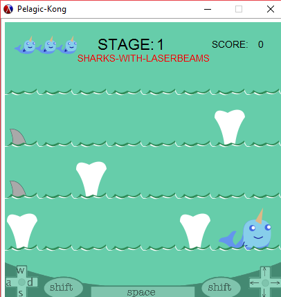

# Jake-Phillips-and-Kelly-Stilson
____
# Pelagic-Kong
***
## Statement
***
Our project is a game in the style/inspired by Donkey Kong. 
This is personal for us because Jacob's girlfriends', grand-father helped to develop the original Donkey Kong 
and Kelly has played it a couple times.
It is interesting because we both wrote similar games in C++ for previous courses and we used those games as inspiration.

## Analysis:
***
### Structs/Objects used:
- World
- Player    
- Stage 
- Tile
- Shark(enemy)
- Super-Powers

Using the struct to define the object provided constructors and accessors for the fields they contained. 
This allowed us to pass large packets of information between functions and access the fields as necessary. The objects also contained a field for the state, 
which was used for state-modification.
```racket
;  constructor= (make-world state time player difficulty score stage)
;  eq test= world?
;  fields= world-state, world-player

(define-struct/contract world ([state (or/c 'splash_screen
                                            'start
                                            'playing
                                            'paused
                                            'won
                                            'lost
                                            'help_screen
                                            'help_screen_2)]
                               [time (and/c natural-number/c (<=/c 100000))]
                               [player (or/c #f player?)]
                               [difficulty (and/c natural-number/c (<=/c 1000))]
                               [score (and/c natural-number/c (>=/c 0))]
                               [stage (or/c #f stage?)])
  #:transparent)
```

### Recursion:
***
Recursion was utilized to draw some of the images in our game. It was difficult because many of the 2htdp/image library combinator functions use relative points to combine and place the images. Some combinators were used in map functions to apply the combinator to a list of objects.
```racket
; takes image and qty as args
; recursive call to draw next shape in image
; returns image object
 (define (draw-sharknado image s)
   (let* ([angle (if (zero? (remainder s 3)) 0 -2)]
          [color (if (zero? (remainder s 5)) dark-wind light-wind)]
          [x-offset (if (zero? (remainder s 3)) (- 0 (random 1 10)) (random 1 10))]
          [y-offset (random 4 6)]
          [width (* s 7)]
          [height (* 10 (ceiling (/ width 100)))])
   (cond ((zero? s) image)
         ((overlay/align/offset "center" "top"
                                (rotate angle (ellipse width height "solid" color))
                                x-offset y-offset
                                (draw-sharknado image (sub1 s)))))))
```

The tornado base of the Sharknado is an ellipse drawn recursively based on the number passed to the function. The sharkfins are placed on the tornado afterwards. 

The background image of waves and spouts is actually made up of rows of tiles. The list of positions used to place the tiles is built using a recursive function, and once the width of all the tiles in the row has reached the window size, it stops. 
```racket
(define (make-wide x y l)
  (if (eq? 0 x) l
      (make-wide (- x TILE_WIDTH) y (append (list (make-posn (- x (quotient TILE_WIDTH 2)) (+ y (quotient TILE_HEIGHT 2)))) l))))

(define (build-posn-list x y l)
  (if (< y TILE_HEIGHT) l
      (build-posn-list x (- y TILE_HEIGHT) (make-wide x (- y TILE_HEIGHT) l))))
```


### Map/Fold/Filter
***
The board, a list of tiles, was created using a map function to generate a list of tile objects. 

The enemies, or list of sharks, was created using a map function based on the difficulty level and stage number.

Fold was used to detect object collision between the player character and the list of enemies. 

We used state modification to maintain the state of game-play and pass messages between the world, stage and other objects.


### Deliverable and Demonstration
***
The end game was a playable game. To that end, we have succeeded. 
Our game is playable, and we have fixed most of the bugs we found. 
Everything planned may not have been implemented, but it can be played. 


### Evaluation of Results
***
We will know we are sucessfull if people are able to play the game.
Frustration regarding the outcome, or score, of the game is not a concern when evaluating success or failure on our part.

## Architecture Diagram
***
<!-- Embedded image, so it can change if we need it to without having to reload it... --> 
<!-- https://www.gliffy.com/go/share/image/sog6wdsn426669cb6gvi.png?utm_medium=live-embed&utm_source=googleapps --> 


## Schedule
---
There was Lots of hard work, late nights and frustration. Happily, no smashed computers :)

### First Milestone (Sun Apr 9)

- [x]  Splash Screen(Main menu)  
- [x]  Stage One-Background Tiles  
- [x]  Character Image  
- [ ]  Character movement  
- [x]  Enemy Image  
- [ ]  Enemy Movement  
- [x]  Score calculations  

 

We did not complete Character movement and Enemy movement for the first milestone as planned.
We met our other goals, however the Splash-screen, background tiles and images were upgraded
 as we continued to improve the game in the coming weeks.

### Second Milestone (Sun Apr 16)

- [x]  Stage One complete  
- [x]  Stage Two thru Five-Background tiles  
- [x]  Character movement
- [ ]  Enemy Movement 
- [ ]  Character Development- Added Super Powers  
- [ ]  Score Tracking  

  

Some items from our first milestone that were not complete were moved to the second.
Character movement was achieved, but not perfected. Backgound and other images were finalized.
Enemy movement was not complete and character super-powers were not fully implemented.

### Public Presentation Wed Apr 26

- [x]  Stage One thru Five complete  
- [x]  All Character movement and interactions  
- [ ]  High scores tracked and stored in database. 

  

While the number of stages and difficulty levels was increased from our initial goal, because of the implementation
 it was easy to create more. Stages 1-9 and 3 difficulty levels. The Walley character moves and interacts with the 
enemies and board and can use the super-powers.

## Group Responsibilities

### Jake Phillips @Jacob-Phillips
will write the code responsible for the main menu, the score calculations, tracking and saving to database and the tiles.

### Kelly Stilson @Stilsonkl
***
- I created all the images used in the game. 
- I used different methods from the 2htdp/images library to draw all the character and shark images. 
- I was able to animate the images by including an on-tick function to advance time as well as facilitate movement of the Walley character sprite and sharks. 
- I wrote the functions to create and place the tiles for the background; create, place, animate and detect collisions
 with the sharks and the character sprite. 
- I wrote the structs to house all the data regarding these objects in order to pass the packages of information to the functions
 called by the big-bang that runs the game.  
 - I wrote the functions to implement the super-powers.
 - I implemented the ability to determine win/loss state of stage and advance the stage, re-start the stage if the character dies, game-over, or won the game.
 
