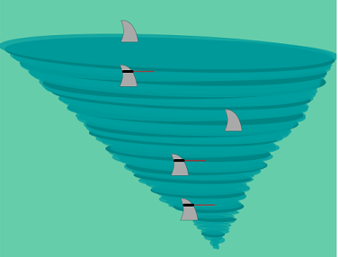
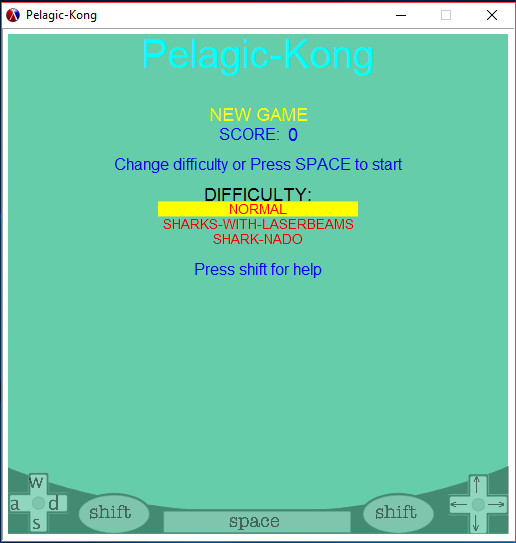
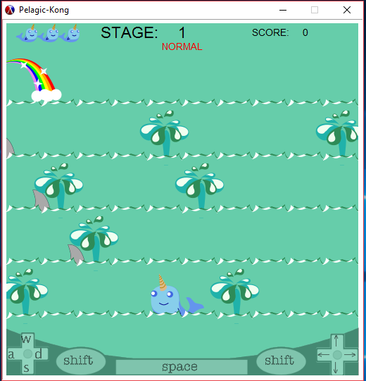
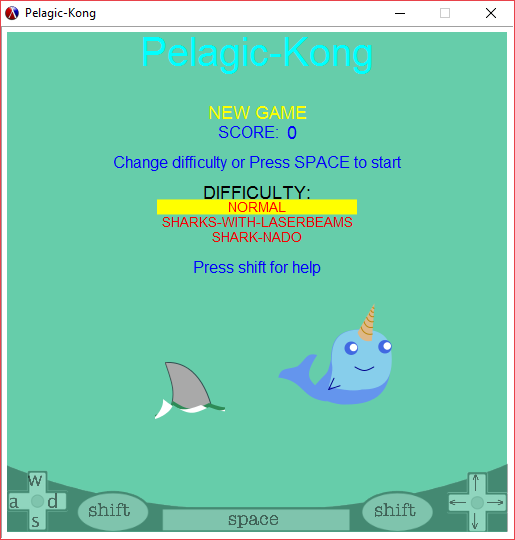
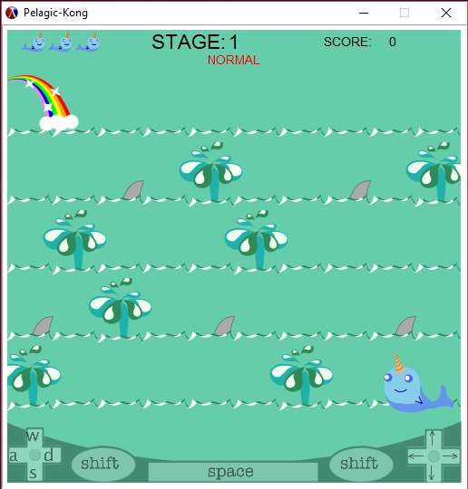

# Pelagic-Kong
### Kelly Stilson
### Overview
Our project is a game in the style/inspired by Donkey Kong. 
This is personal for us because Jacob's girlfriends', grand-father helped to develop the original Donkey Kong 
and Kelly has played it a couple times.
It is interesting because we both wrote similar games in C++ for previous courses and we used those games as inspiration.

### Librries used:


- 2htdp/universe:

- 2htdp/images:


```racket

```

### Using Recursion and Map to build the game board:

Several recursive functions were used to create the board, or the background of each stage. The background is a list of tile objects implemented in such a way as to form a matrix, with each tile having an x and y position on the board. To create a tile object, the program needs to know if it is a spout tile (#t/#f) and its position on the baackground. It stored the position of the tile so that it can be referenced during gameplay to verify that the player is on, or near, a water spout tile in order to move up to the next 'floor.'

The stage starts out as a list of integers which represent the numbered position in the board matrix that the spouts should be placed.
```racket    
;spout list ;returns list of integers
(define (spout-list d) 
  (let ([l (stage_number d)])  
(cond ((eq? l 1) (list 14 19 21 25 32 40 46))  
     ((eq? l 2) (list 17 21 28 35 41 46))    
     ((eq? l 3) (list 19 25 30 39 45)) 
     ((eq? l 4) (list 15 24 26 33 37 42 48)) 
     ((eq? l 5) (list 13 17 25 33 37 44 45 46))  
     ((eq? l 6) (list 12 18 23 36 45)) 
     ((eq? l 7) (list 16 21 29 35 47)) 
     ((eq? l 8) (list 13 25 37 49))  
     ((eq? l 9) (list 14 18 21 29 33 46))  
     (else (list 14 18 24 29)))))  
                                         
(define-struct/contract tile ([up? boolean?] 
                             [position any/c]) 
 #:transparent)                                
```                                            
The tile-posn-list is a list of posn objects created using two recursive functions. The first being build-posn-list, which takes an x value, y value and a list. This function creates the 'rows' of the board. If the y-value argument is too small to fit another tile, then the list is returned, if not, then it calls the make-wide function. 
```racket
(define (tile-posn-list d)
  (build-posn-list (posn-x WINDOW) (- (posn-y WINDOW) TILE_HEIGHT) '()))

(define (build-posn-list x y l)
  (if (< y TILE_HEIGHT) l
      (build-posn-list x (- y TILE_HEIGHT) (make-wide x (- y TILE_HEIGHT) l))))
      
(define (make-wide x y l)
  (if (eq? 0 x) l
      (make-wide (- x TILE_WIDTH) y 
                    (append (list (make-posn (- x (quotient TILE_WIDTH 2)) (+ y (quotient TILE_HEIGHT 2)))) l))))
```
The make-wide function creates the posn's for the columns of the board. If the x-value argument reaches 0 then it will return the list, if not, it will call the function again, decreasing the x-value by the width of a tile, and appending a new posn to the list.

The build-board function only takes the difficulty level of the stage as an argument. It uses let\* to determine the number of rows and columns required in the board matrix based on the size of the window and the size of the tiles. 
*Note: this functionality was built-in incase we got to the point of creating more difficult levels where there were more "floors," or rows of tiles, and would therefore have to scale the size of the tile.*
It then maps through the list of #t/#f values for determining the type of tile, and the list of positions, created recursively, and calls the tile constructor, to return a list of tiles. 

```racket
;;builds a list of tiles based on stage list
;makes list of t/f the size of x*y
;makes list of positions based on x*y and window size
;uses map to create list of tile objects
(define (build-board diff-level)
  (let* ([x (/ (posn-x WINDOW) TILE_WIDTH)]
         [y (quotient (- (posn-y WINDOW) TILE_HEIGHT) TILE_HEIGHT)])
    (map (lambda (s p) (make-tile s p))
         (for/list ([i (in-range 0 (* x y))])
           (if (member i (spout-list diff-level)) #t #f))
         (tile-posn-list diff-level))))
```


##Recursive Image Drawing

```racket
; takes image and qty as args
; recursive call to draw next shape in image
; returns image object
 (define (draw-sharknado image s)
   (let* ([angle (if (zero? (remainder s 3)) 0 -2)]
          [color (if (zero? (remainder s 5)) dark-wind light-wind)]
          [x-offset (if (zero? (remainder s 3)) (- 0 (random 1 10)) (random 1 10))]
          [y-offset (random 4 6)]
          [width (* s 7)]
          [height (* 10 (ceiling (/ width 100)))])
   (cond ((zero? s) image)
         ((overlay/align/offset "center" "top"
                                (rotate angle (ellipse width height "solid" color))
                                x-offset y-offset
                                (draw-sharknado image (sub1 s)))))))
```

The tornado base of the Sharknado is an ellipse drawn recursively based on the number passed to the function.*Note: Again, this was done so that we could scale the image based on the window size*
The sharkfins are placed on the tornado afterwards. 

### Map/Fold/Filter

The board, a list of tiles, was created using a map function to generate a list of tile objects. 

The enemies, or list of sharks, was created using a map function based on the difficulty level and stage number.

Fold was used to detect object collision between the player character and the list of enemies. 

We used state modification to maintain the state of game-play and pass messages between the world, stage and other objects.


### Deliverable and Demonstration
***
The end game was a playable game. To that end, we have succeeded. 
Our game is playable, and we have fixed most of the bugs we found. 
Everything planned may not have been implemented, but it can be played. 

### Evaluation of Results

We will know we are sucessfull if people are able to play the game.
Frustration regarding the outcome, or score, of the game is not a concern when evaluating success or failure on our part.

## Architecture Diagram
***
<!-- Embedded image, so it can change if we need it to without having to reload it... --> 
<!-- https://www.gliffy.com/go/share/image/sog6wdsn426669cb6gvi.png?utm_medium=live-embed&utm_source=googleapps --> 


## Schedule
---
There was Lots of hard work, late nights and frustration. Happily, no smashed computers :)

### First Milestone (Sun Apr 9)

- [x]  Splash Screen(Main menu)  
- [x]  Stage One-Background Tiles  
- [x]  Character Image  
- [ ]  Character movement  
- [x]  Enemy Image  
- [ ]  Enemy Movement  
- [x]  Score calculations  

 

We did not complete Character movement and Enemy movement for the first milestone as planned.
We met our other goals, however the Splash-screen, background tiles and images were upgraded
 as we continued to improve the game in the coming weeks.

### Second Milestone (Sun Apr 16)

- [x]  Stage One complete  
- [x]  Stage Two thru Five-Background tiles  
- [x]  Character movement
- [ ]  Enemy Movement 
- [ ]  Character Development- Added Super Powers  
- [ ]  Score Tracking  

  

Some items from our first milestone that were not complete were moved to the second.
Character movement was achieved, but not perfected. Backgound and other images were finalized.
Enemy movement was not complete and character super-powers were not fully implemented.

### Public Presentation Wed Apr 26

- [x]  Stage One thru Five complete  
- [x]  All Character movement and interactions  
- [ ]  High scores tracked and stored in database. 

  

While the number of stages and difficulty levels was increased from our initial goal, because of the implementation
 it was easy to create more. Stages 1-9 and 3 difficulty levels. The Walley character moves and interacts with the 
enemies and board and can use the super-powers.

## Group Responsibilities

### Jake Phillips @Jacob-Phillips
***
- I created the original Help Screen and its functionallity.
- Added on to the functionallity of the Splash screen.
- I wrote the code for the user to move walley side to side using a pad-event.
- I added functioality to the help screen.
- I added functionallity to the Won and Lost screens.
- I added a pause screen that uses a key-event to determine to quit or continue.
- Added horizontal wrapping at the left and right edges of the screen. (If walley leaves off the left side he appears on the right)
- I wrote he code that allows Walley to move up(using a pad-event) but only while on spouts.(Based on if that tile contains a spout)
- Fixed bug which allowed Walley to move side to side while on the Spouts.

### Kelly Stilson @Stilsonkl
***
- I created all the images used in the game. 
- I used different methods from the 2htdp/images library to draw all the character and shark images. 
- I was able to animate the images by including an on-tick function to advance time as well as facilitate movement of the Walley character sprite and sharks. 
- I wrote the functions to create and place the tiles for the background; create, place, animate and detect collisions
 with the sharks and the character sprite. 
- I wrote the structs to house all the data regarding these objects in order to pass the packages of information to the functions
 called by the big-bang that runs the game.  
 - I wrote the functions to implement the super-powers.
 - I implemented the ability to determine win/loss state of stage and advance the stage, re-start the stage if the character dies, game-over, or won the game.
 
